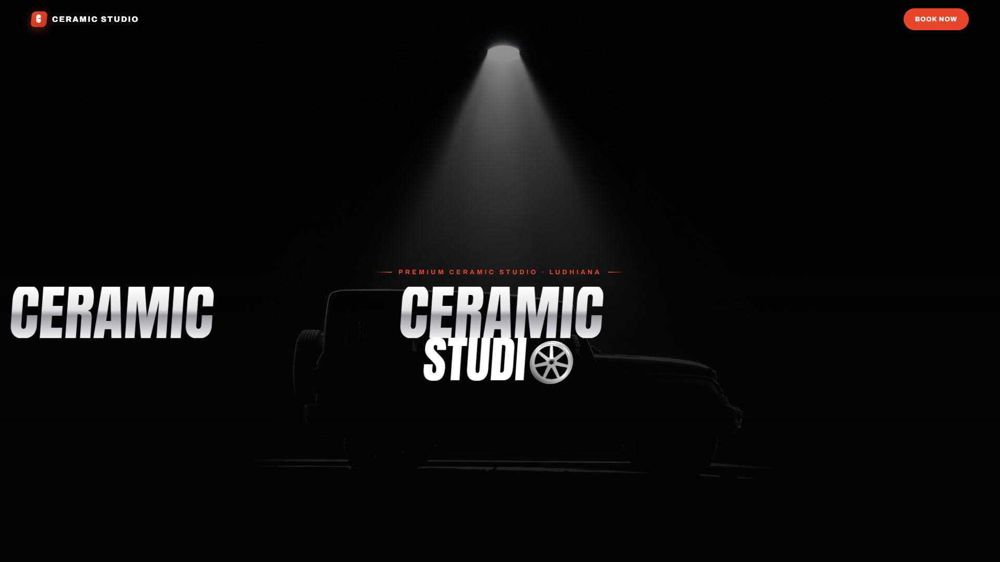

# CERAMIC STUDIO - Premium Luxury Car Detailing Website



A high-end, professionally developed, responsive landing page designed for luxury car detailing, ceramic coating, and paint correction studios. 

Built with an obsessive focus on performance, modern aesthetics, and seamless lead generation.

## 🚀 Live Demo & Deployment

This project is fully static and optimized for zero-configuration deployments on platforms like **Vercel**, **Netlify**, or **GitHub Pages**.

## 🌟 Key Features

- **Cinematic Hero Section:** Features advanced 3D Parallax Tilt effects (using Three.js) for an ultra-premium feel.
- **Smart WhatsApp Booking Integration:** Custom-built form that performs inline validation and seamlessly routes formatted booking requests directly to the studio's WhatsApp. Uses device detection for flawless mobile/desktop routing.
- **Dynamic 3D Map Integration:** Interactive map powered by MapLibre GL for an engaging location showcase.
- **Responsive Grid Architecture:** 13 distinct breakpoints ensure a flawless viewing experience from 320px mobile screens to 4K ultrawide monitors.
- **Performance First:** Pure Vanilla JavaScript, HTML5, and CSS3. Zero heavy frameworks, zero database queries, ultra-fast load times.

## 📁 Project Structure

```text
/
├── index.html            # Main semantic HTML structure
├── css/
│   ├── style.css         # Core styles, CSS variables, and layout
│   ├── responsive.css    # Media queries for all device sizes
│   └── animations.css    # Keyframes, micro-interactions, and reveal effects
├── js/
│   ├── main.js           # Core UI logic (Intersection Observers, Navbar scroll)
│   ├── whatsapp.js       # Advanced WhatsApp booking & validation logic
│   └── map.js            # MapLibre GL configuration and rendering
├── images/               # High-quality AI-generated studio imagery
└── README.md             # Project documentation
```

## 🛠️ Customization Guide

### 1. Update the WhatsApp Number
To receive bookings, update the `OWNER_WHATSAPP` constant in `js/whatsapp.js`:
```javascript
const OWNER_WHATSAPP = "919888641543"; // Include country code, no +, no spaces
```

### 2. Modify Services
Open `index.html` and locate the `<select id="service">` dropdown in the booking section to add/remove your specific services.

### 3. Theming & Colors
The entire color palette is controlled via CSS variables. Open `css/style.css` and adjust the `:root` variables:
```css
:root {
    --cream: #F7ECDF;     /* Background */
    --white: #FFFFFF;     /* Cards */
    --ink: #1E1813;       /* Primary Text */
    --red: #E8462A;       /* Accents & Buttons */
}
```

## ⚡ Tech Stack

- **HTML5** (Semantic & Accessible)
- **CSS3** (Flexbox, CSS Grid, Custom Properties)
- **Vanilla JavaScript** (ES6+)
- **Three.js** (3D Wheel rendering)
- **MapLibre GL JS** (Interactive Maps)

---
*Crafted for detailers who demand the same level of perfection in their digital presence as they do in their studio.*
